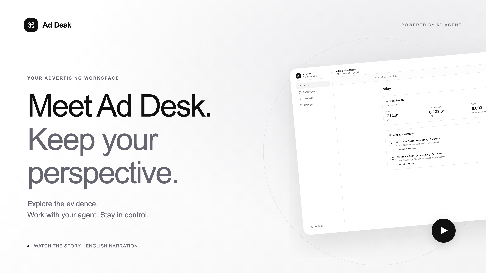

# Ad Agent

A local-first advertising workspace with an agent that can analyze performance and
prepare changes—while you keep approval and execution authority.

**Ad Desk** is the Web workspace for this project; **Ad Agent** is its embedded
advertising assistant. The repository, CLI, and underlying agent project remain `ad-agent`.

**Alpha · Single operator · Go + React · MIT source license**

[CI](https://github.com/z-chenhao/ad-agent/actions/workflows/ci.yml) ·
[Contribute](CONTRIBUTING.md) · [Roadmap](docs/roadmap.md)

Use one Advertiser workspace or manage several authorized accounts in Manager scope.
Explore the persistent Sandbox without TikTok credentials. Connect TikTok Marketing API
when your app and account authorization are ready. Choose Built-in Runtime, Pi, Codex App Server, or Claude Agent
SDK independently of the advertising backend.

## See Ad Desk in action

[](docs/product-film.mp4)

[Watch the 2-minute film](docs/product-film.mp4) · 4K · English narration and captions

From “what changed?” to an informed next step: explore campaigns, creative assets,
inspectable Agent findings and your approval boundary. Real application footage; the
Agent analysis is a saved read-only session replay, not a new live generation.
[Transcript and credits](docs/product-film.md) · [Detailed product tour](docs/product-tour.md)

## Start locally

Requires Go 1.26.8+ and Node.js 24.14+.
Linux is exercised in CI; macOS is used for local acceptance. Windows is not yet validated.

```sh
git clone https://github.com/z-chenhao/ad-agent.git
cd ad-agent
npm ci --ignore-scripts
make smoke
./bin/ad-agent serve --addr 127.0.0.1:8090 --data-dir .data/local
```

`make smoke` builds the application and checks fresh Sandbox reports, restart persistence,
and deterministic harness events in temporary state. It needs no model or TikTok login,
does not send chat requests, and leaves existing workspaces untouched.

Open **http://127.0.0.1:8090** and sign in with the private `operator-key` file at the
path printed by the server. Keep the listener on loopback and do not share that key.
Sandbox browsing, charts and clock controls need no model credentials. Agent chat uses
your configured model connection and consumes provider quota.

The default chat connection is Pi with ChatGPT OAuth and `openai-codex/gpt-5.6-luna`.
Complete Pi's login separately; the application reads it without changing global defaults.
Model availability depends on your provider/account. Other supported models and explicit
HTTP URL/API-key connections are configurable; see [model connections](docs/model-connections.md).

## The operating loop

- **Today:** review account health and observed performance movements.
- **Campaigns and Creatives:** inspect campaigns, ad groups, ads, assets and period comparisons.
- **Agent:** ask questions, inspect public tool activity, and prepare evidence-backed drafts.
- **Changes:** review exact fields, approve one draft, and inspect execution/read-back results.
- **Manager:** triage accounts while preserving each currency, timezone and authorization boundary.

The agent cannot approve or apply changes. Budget policy is checked at staging and again
before execution. A returned resource ID is not proof of success: creation is confirmed
only after submitted settings, hierarchy and disabled status are read back. Partial or
unknown outcomes remain explicit and are not blindly retried.

## Architecture


The **Agent Application** binds accounts, tools, sessions and events. The **Change Service**
enforces approval, policy and write authority. **Agent Runtime** adapters own the model/tool
loop. **AdBackend** adapters own advertising integration.

Runtime, AdBackend and model connection are independent choices, subject to runtime
compatibility. Built-in Runtime and Pi support ChatGPT OAuth and explicit HTTP providers; Codex supports
ChatGPT OAuth or Responses HTTP connections; Claude SDK
uses Anthropic API-key transport. Sandbox contains the simulator and reporting layer;
TikTok MAPI is a separate backend implementation. The dashed Meta adapter is future work.
Conversations survive runtime/model changes within the same advertising source. Public
history is retained; native checkpoints and current advertising evidence are not portable.
[Architecture details](docs/architecture.md) ·
[Editable diagram](docs/architecture.excalidraw) · [Agent harness](docs/agent-harness.md)

## Sandbox: persistent advertising state

Sandbox is an isolated virtual advertiser, not a list of canned scenarios. It persists
campaigns, ad groups, ads, creative bindings, audiences, rules, comments, approvals and
time. Approved definitions affect subsequent delivery; resources without relevant traffic
do not acquire invented telemetry.

Delivery follows cohort opportunities → eligibility → pacing → sampled auctions →
impressions → clicks → conversions → revenue → attribution → reporting. CTR, CPM, CPA
and ROAS are derived from events. Daily/lifetime caps, audience saturation, creative fatigue,
competition, landing-page quality and tracking affect distinct causal stages. Same state,
actions and seed reproduce the same metric outcome.

This is an **experimental behavioral abstraction**, not a replica of a platform's private
algorithms or a calibrated predictor. The agent sees reported data, not simulator truth.
[Model assumptions and limitations](docs/sandbox-simulator.md)

```sh
./bin/ad-agent inspect
./bin/ad-agent report --level campaign --start 2026-08-28 --end 2026-09-03
./bin/ad-agent serve --scope manager --sandbox-environment manager-lab \
  --data-dir .data/manager --addr 127.0.0.1:8091
```

## Capability and evidence boundaries

| Area                   | Current scope                                                                                                               |
| ---------------------- | --------------------------------------------------------------------------------------------------------------------------- |
| Advertising operations | Campaign bundles, budgets/status, group targeting/bid/schedule, creative updates, audiences, rules, comments, event sources |
| Sandbox                | Persistent local implementation and deterministic causal tests                                                              |
| TikTok MAPI            | Read/write adapters and HTTP-fake wire tests; live platform acceptance pending                                              |
| Runtime adapters       | Built-in/Pi/Codex/Claude bridge tests; native Codex HTTP-fake checks; live-model availability is a separate check           |
| Knowledge              | Five advertiser skill domains plus Manager routing; unsupported workflows remain staged                                     |
| Not production-ready   | Multi-tenant hosting, live Manager authorization, Smart Plus/GMV Max, calibrated simulator predictions                      |

TikTok writes are **off by default**. Developer approval, scopes and controlled read/write
acceptance are required before enabling them. Local tests are not live-platform evidence.
[Capability map](docs/capabilities.md) · [AdBackend contract](docs/ad-backend-contract.md) ·
[Skill governance](docs/skills.md)

## Develop and diagnose

For agent application builders, this repository is a working example of application-owned
tool authority, runtime-independent conversations, and approval/read-back boundaries.
For advertising-tool contributors, Sandbox provides reproducible state without an ad account.
These are inspectable implementations, not a stable SDK or evidence of production adoption.
Start with a [small contribution](CONTRIBUTING.md#good-first-contributions) or the
[maintainer workflow](docs/maintaining.md).

```sh
make test
go vet ./...
npm run check
make test-web
make test-web-manager
./bin/ad-agent verify
```

Ordinary tests do not require model or TikTok credentials. Private structured server and
Agent trace logs correlate requests and turns without recording credentials, request bodies
or private reasoning. See [local operation and logs](docs/local-development.md),
[validation gates](docs/validation.md), and [contributing](CONTRIBUTING.md).

## License and status

Version **0.1.0-alpha.1**. APIs and storage schemas may change; preserve private state backups.
This source release candidate has not passed controlled-live TikTok acceptance.

Original code is [MIT-licensed](LICENSE). Demo media and dependencies retain their own
licenses; see [third-party notices](THIRD_PARTY_NOTICES.md). The fictional advertiser does
not imply creator or platform endorsement. [Security](SECURITY.md) · [Changelog](CHANGELOG.md)
