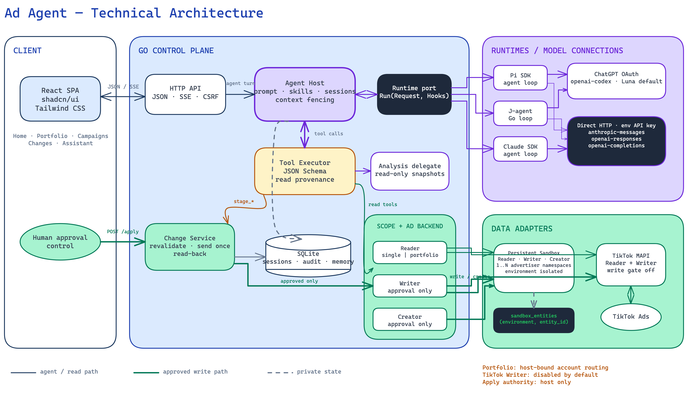

# System architecture

Ad Agent is a local-first application for one operator. Advertiser scope binds one
account; Manager scope routes among explicitly authorized accounts. The Web Workspace
and CLI consume the same application services. This is an alpha, not a multi-tenant service.

## Components and authority

| Component         | Responsibility                                                     | Implementation                                                 |
| ----------------- | ------------------------------------------------------------------ | -------------------------------------------------------------- |
| Web Workspace     | Navigation, charts, conversation, activity, exact change review    | React, Tailwind CSS, shadcn/ui-style primitives                |
| API Server        | Operator authentication, origin/CSRF enforcement, HTTP and SSE     | `internal/httpapi`                                             |
| Agent Application | Account binding, sessions, business tools, prompts, public events  | `internal/agenthost`, `internal/manager`, `internal/prompting` |
| Change Service    | Drafts, policy, approval, one write attempt, reconciliation        | `internal/agenthost/changes.go`                                |
| Agent Runtime     | Model interaction and model/tool loop                              | `internal/runtime`, `runtime/`                                 |
| AdBackend         | Account-scoped reads and separately injected mutation capabilities | `internal/ads`, `internal/sandbox`, `internal/tiktokmapi`      |
| State Store       | Sessions, evidence, changes, audit, Sandbox state                  | `internal/store`, SQLite                                       |

Go implements application services; it is not an architectural authority. The **Change
Service** owns write authority. Internal package/type names are not public extension APIs.

## Independent replacement boundaries

The diagram separates two implementation interfaces from model-connection configuration.
Branches show alternative implementations or connection choices, not sequential execution
or automatic failover. Dashed elements are future work, not available capabilities.

| Boundary         | Current contract                                                | Implementations or choices                                                  |
| ---------------- | --------------------------------------------------------------- | --------------------------------------------------------------------------- |
| Agent Runtime    | `runtime.Runtime.Run(ctx, Request, Hooks)`                      | Built-in Runtime, Pi SDK, Codex App Server, Claude Agent SDK                |
| AdBackend        | `ads.Backend`: `Reader` + `Writer`                              | Ad Sandbox and TikTok MAPI; Meta Ads API is future work only                |
| Model Connection | `runtime.ModelSelection` configuration passed with each request | ChatGPT OAuth or explicit direct HTTP; compatibility depends on the runtime |

AdBackend's typed operation and creation capabilities are separately injected extensions,
not universal methods promised by the core `Reader`/`Writer` interface. The application
receives reads and staging capabilities; only Change Service receives execution authority.
An adapter's presence does not imply every operation or live-platform validation is complete.

The application supplies advertising tools to four peer runtime adapters. **Built-in Runtime**
is the project's lightweight model/tool loop with a model-only TypeScript transport.
Its engineering identifier is `builtin`; dependency identities remain in the license notices.
**Pi SDK**
owns its agent session and loop. **Codex App Server** owns a native loop behind a private
stdio adapter, not the product API. **Claude Agent SDK** owns its SDK loop with only
application-supplied tools. Data comes independently from Sandbox or TikTok AdBackend.

Model connection is a third choice. Built-in Runtime, Pi and Codex accept ChatGPT OAuth or an explicit HTTP
provider configuration: protocol, URL, model, and an environment-variable credential or
server-memory key. OpenRouter OAuth uses a separate PKCE exchange to obtain a server-memory
provider key; it is not a ChatGPT subscription connection.
Built-in Runtime and Pi protocols are OpenAI Responses, OpenAI-compatible Chat Completions, and Anthropic Messages.
Codex direct HTTP supports OpenAI Responses only.
Claude SDK accepts Anthropic API-key transport only. Business sessions retain their identity
when the operator changes runtime/model. Native checkpoints belong to an exact execution
binding and the compiled system/tool contract; they are discarded when either changes.
Deployment or skill edits rebuild bounded public context before model execution, without
replaying tools or losing conversation identity. The contract fingerprint stays private.
Protocols are not inferred from URLs;
global Pi defaults are never changed.

| Runtime          | ChatGPT OAuth                               | Direct HTTP                                                                                   |
| ---------------- | ------------------------------------------- | --------------------------------------------------------------------------------------------- |
| Pi SDK           | Selectable Codex model; Luna is the default | Declared OpenAI Responses, OpenAI-compatible Chat Completions, or Anthropic Messages protocol |
| Built-in Runtime | Selectable Codex model; Luna is the default | The same three declared protocols                                                             |
| Codex App Server | Selectable Codex model; Luna is the default | OpenAI Responses only                                                                         |
| Claude Agent SDK | Not supported                               | Anthropic API-key transport only                                                              |

Provider names such as OpenAI, DeepSeek and OpenRouter denote configurable HTTP destinations,
not additional runtime implementations. Their endpoint, protocol and model must agree; a
custom URL alone does not establish compatibility. OpenRouter OAuth supplies a key for the
HTTP connection shown in the diagram. See [model connections](model-connections.md).

Codex App Server's experimental dynamic-tool protocol stays inside the adapter. Native
plans, empty skill discovery and model-selected restricted Code Mode are execution details;
only application callbacks can obtain advertising evidence or stage changes. Native
approval never grants business write authority. See [implementation and tradeoffs](codex-runtime.md).

Workspace settings construct replacement application services while idle, validate them,
persist non-secret configuration, and then swap them behind the request gate. These are
private, experimental alpha settings, not a public plugin/configuration standard. The
operator can choose existing implementations; account authorization and live-write grants
remain deployment-owned. This avoids rebuilding a plugin framework or exposing the internal
domain model as a universal settings API. See [workspace settings](local-development.md#workspace-settings).

## Agent execution

### Internal collaboration

Agent Application is a composition boundary, not a set of separately deployed services.
The diagram expands its current implementation into collaborating responsibilities:

| Diagram module    | Code ownership                                    | Collaboration                                                                                      |
| ----------------- | ------------------------------------------------- | -------------------------------------------------------------------------------------------------- |
| Turn Coordinator  | `Host.RunWithModelAndView`                        | Binds account/session, assembles the runtime request, installs hooks and settles the turn          |
| Prompt Assembly   | `prompting.Compile`, `BuildContext`               | Combines kernel/scope, tool capabilities and skill index; adds bounded per-turn context separately |
| Skill Catalog     | `SkillRegistry`                                   | Supplies the scoped prompt index and the guides returned by `load_skill`                           |
| Business Tools    | `turn.execute`, `turn.dispatch`                   | Validates calls, reads AdBackend, records report handles, delegates analysis and stages changes    |
| Session & Events  | Coordinator and `turn.event`, using `store.Store` | Saves session state, persists ordered events, then emits them to the API/CLI consumer              |
| Dataset Handles   | `turn.reports`                                    | Retains full bounded reports in current-turn memory and grants selected handles to analysis        |
| Analysis Delegate | `turn.analyze`                                    | Runs an isolated child through the selected Runtime with only read-only analysis tools             |

Arrows show calls or data dependencies, not a mandatory agent workflow. Prompt Assembly
supplies request content; the coordinator, not the compiler, invokes Runtime. Runtime tool
calls return through application-owned hooks. Business Tools alone connect reads to
AdBackend and staging to Change Service. Delegation is optional, not required for every turn.

### Datasets versus persisted records

Dataset Handles is logical turn state, not a standalone dataset service or SQLite table.
`get_performance_report` reads the bound backend, checks source/size, assigns a report ID
and retains the report in `turn.reports`. The model receives a bounded preview. Analysis
receives only a selected handle map and may slice or calculate within that granted data.
`submit_analysis` must reference server-calculated evidence before its result is accepted.
The analyst cannot query arbitrary SQLite records, acquire new backend data directly,
or gain mutation provenance.

SQLite stores `sessions`, `events`, `changes`, `audit`, `memories` and Sandbox state/facts.
Presented cards and their included evidence survive through saved events, but that is
not durable storage or restart recovery of the complete current-turn dataset map. Analysis
slices and calculations are also turn-local unless included in a persisted presentation.
For Sandbox, the data path is persisted simulation facts → AdBackend report → turn-local
dataset → delegated calculation; these are distinct lifecycles, not one shared table.

This expansion documents private implementation seams for repository contributors. It does
not introduce new services or promise a stable dataset API. A persistent dataset repository
would be a separate implementation decision; drawing one now would misstate current behavior.

### Prompt and runtime lifecycle

The prompt compiler combines the system kernel, one scope policy, deployment capabilities,
and filtered skill index. Account data, reports, navigation hints, and business memory are
bounded per-turn inputs outside that stable prefix.

The runtime chooses tools and analysis steps. Current application policy includes intent
grounding, a bounded follow-through pass for an unstaged requested change, trusted UI
enrichment, and optional post-turn memory extraction. These are application policies, not
runtime framework semantics. Main loops have no fixed turn ceiling; cancellation, deadlines,
provider limits, and tool safety still apply.

Analysis delegates receive isolated read-only contexts over application-issued datasets.
They cannot approve, apply, or inspect simulator truth. Public lifecycle/tool events stream
to the UI and remain attached to each saved turn. Completed turns retain an expandable
activity summary, Markdown answer, and turn-owned cards. Current navigation context is sent
with the next message and recorded as `context.bound`; it does not retroactively modify
past turns or supply factual metrics. Grounding reads honor its selected object and dates.
Each user message displays its saved snapshot through a collapsed Context disclosure
below the bubble, separate from execution activity and next-message Current context.
Private provider reasoning is not a product contract.

### Conversation continuity

The application owns the conversation; a runtime owns only its execution checkpoint.
Settings keep the current session when its AdBackend source is unchanged. They are saved
under the workspace gate and current-session lease. A different account/environment gets
a new conversation; its old source-bound history and drafts remain intact. The Web keeps
navigation, the composer draft, cards and history when only execution/settings change.

At the next turn, `Session.SelectExecution` validates the selected runtime/model and
invalidates an incompatible checkpoint under the session lease. Returning to a previously
used runtime also starts a fresh native context: it never resumes a fork missing intervening
turns. Same-binding successful turns retain native continuity. Unsettled failures clear the
checkpoint so subsequent requests rebuild from recorded application outcomes.

Without a checkpoint, the application injects a bounded `conversation_history` projection
from SQLite: recent user/assistant messages with outcome status, saved navigation context,
presented cards and tool success/failure metadata. `read_conversation` pages older turns
inside the same bound session. The current policy is up to six turns and 24 KB per page;
long text/cards are explicitly truncated or omitted, never written back over stored history.
This is public-record continuity, not lossless conversion of native transcripts: private
reasoning and unpresented raw tool results are not transferred. Full turn-local report
handles are not revived. Historical claims require fresh reads, and the live change ledger
remains authoritative for approval/execution status.

This private alpha seam serves the existing advertiser and manager hosts. It introduces no
universal transcript protocol, provider-state converter, automatic summary model, new store
or data migration. The tradeoff is some additional context on a switch, bounded historical
detail, and possible rereads in exchange for portable conversation identity and unchanged
business authority. Switching providers sends this application context to the explicitly
selected model connection; credentials and native private state stay outside it.

## Change execution

1. Stage a typed request against account-bound evidence.
2. Validate budget policy and generate exact field-level review lines.
3. Obtain authenticated approval for that stored draft.
4. Acquire the account lease shared with Sandbox time advancement.
5. Re-read preconditions and recheck current deployment policy.
6. Attempt the write once, retaining compound-create partial results.
7. Verify submitted fields, hierarchy, and disabled creation status by read-back.

Acknowledgements and returned IDs are not success. Missing, mismatched, or delayed
read-back stays unconfirmed. Never blindly retry unknown writes. Saved rules retain their
targets, conditions, action and schedule; future Sandbox budget changes also pass policy.

## Persistence and observability

### Sandbox and simulator

Ad Sandbox is the AdBackend implementation. Its auction simulator is an internal subsystem,
not another backend, standalone service or model-visible tool. Each environment owns its
clock, seed, entities, exposure and learning state, and hourly facts. Advancing time drives
opportunities, auctions, delivery events and attribution; reporting then projects only
available reported facts and derives metrics. Ordinary agent tools cannot read hidden
events, simulator parameters or causal debug traces.

The environment and simulator share the Sandbox lifecycle and persistence boundary. SQLite
stores their snapshots and facts alongside separately scoped application records; the
diagram's Environment box is logical state, not another database. This keeps replay and
atomic advancement local without inventing a simulator service or a universal simulation
interface. The simulator is a behavioral abstraction, not a platform's private delivery
algorithm. See [simulator design](sandbox-simulator.md).

### Storage and diagnostics

SQLite stores application records separately from private runtime checkpoints and
credential files. Sandbox namespaces isolate environments/accounts. Time advancement commits
facts, model state, rule results, billing effects and entity updates in one transaction,
guarded by a clock compare-and-swap and account lease.

Private JSONL logs join request IDs to turn IDs and event sequences. They record request
status/duration and tool metadata, not bodies, credentials or private reasoning. See
[local operation](local-development.md).

## Scope and stability

Identity, explicit approval, provenance, metric denominators and unknown outcomes are
domain-required complexity. Runtime/backend seams have actual independent implementations;
a universal plugin framework is unnecessary. Internal schemas, HTTP contracts and simulator
calibration remain experimental during alpha.

Not exposed or generalized: transcripts, simulator truth, arbitrary write tools, credential
APIs, cross-currency totals or multi-tenant auth. Live Manager composition needs explicit
authorization for each account. Sandbox behavior is not a platform algorithm or predictor.
See [capabilities](capabilities.md), [backend semantics](ad-backend-contract.md), and
[validation](validation.md).
