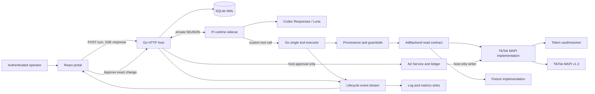

# Ad Agent 初版技术方案（Go + React + TikTok MAPI）

状态：实施基线 v0.5，2026-09-04。CLI/React fixture 闭环和 MAPI HTTP adapter 已实现；真实授权/J 接入仍在实施。

TikTok 契约研究基线：官方 Business API SDK commit
[`f809c39`](https://github.com/tiktok/tiktok-business-api-sdk/tree/f809c396520df2d7b201a9ccc5378d822b728ed3)

## 1. 决策摘要

首版构建一个面向广告投手/运营人员的 Ad Agent，先 CLI 验证，再交付 Web：Go 负责 agent host、
安全门禁、TikTok MAPI 集成和 SSE API；React + TypeScript 负责对话、指标卡、
广告层级浏览与审批队列。模型固定从 `gpt-5.6-luna` 开始。

Harness 由以下相互独立的机制组成：

1. 一个静态 agent contract、一组稳定工具 schema、动态 fenced context。
2. 所有工具路径进入同一个 executor；安全规则不只写在 prompt 中。
3. 读结果建立 session provenance；模型只能引用和修改本 session 已读对象。
4. 写操作走 `propose -> preview -> host approve -> revalidate -> apply -> reconcile`。
5. 展示由 presentation tools 描述，服务端用可信记录补全，React 只渲染协议。
6. 一个类型化 lifecycle event stream，同时供 SSE、日志和指标 sink 消费。

首版不再自写完整 agent loop，而使用 Pi Coding Agent SDK 作为 runtime；Go host
继续拥有 MAPI、轮次预算、权限、审批、持久化与 browser transport。一个极薄的
TypeScript sidecar 将 Pi session/custom tools 映射到 Go executor。模型路径固定为
`openai-codex/gpt-5.6-luna`，认证采用单用户 ChatGPT OAuth。
广告数据接入依赖 repo-private 的 `ads.AdBackend`；`tiktokmapi.Backend` 与
`fixture.Backend` 分别实现真实协议接入与虚构数据。runtime 和 backend 独立替换。
详细职责见 [AdBackend 合同](ad-backend-contract.md)，环境和回调状态见
[开发准备清单](development-readiness.md)。
不建设通用 agent framework、任意插件系统或全量 MAPI 写能力。按用户明确要求，
Pi/CLI/Web 完成并首次推送后，继续实现真实 J-agent runtime；两者复用同一业务边界。

最重要的安全差异是：**模型没有 apply-live-state 工具**。模型可以读取、分析、
生成 staged change；只有 CLI 的独立审批命令或 React 中经过鉴权的审批按钮能触发已授权 writer。

## 2. 具体需求、用户和证据

### 2.1 当前真实需求

- 用户：已登录并获授权管理某 TikTok advertiser 的广告投手或运营人员。
- 读取：账户上下文、campaign/ad group/ad、投放表现与交付状态。
- 分析：回答表现问题，给出有来源、时间窗、基线和局限的解释。
- 变更：先支持单对象预算变更与启停；先预览，再由人审批后写入 TikTok。
- 页面：对话流、可验证的结构化卡片、层级浏览、变更审批和结果状态。
- 技术：产品服务端 Go；页面 React + TypeScript；数据源 TikTok Marketing API。
  唯一例外是嵌入 Pi SDK 所需的极薄 TypeScript runtime sidecar，不承载领域逻辑。

### 2.2 下游契约

- TikTok Business API v1.3：官方 SDK 当前列出了 OAuth advertiser 授权查询、
  campaign/ad group/ad 的 get/create/update/status-update，以及 integrated reporting。
- 模型 API：首个部署使用 Pi 的 `openai-codex-responses` provider、ChatGPT OAuth 和
  `gpt-5.6-luna`，默认 `reasoning.effort=medium`，再用 eval 比较 `low`。模型与认证
  只存在于 runtime sidecar；Go 领域层不依赖 provider 或模型名。
- Browser：同源 HTTP API + SSE 事件协议；浏览器永远不持有 TikTok token。
- 数据库：session、conversation、provenance、staged change、approval、execution
  attempt 和审计记录。

### 2.3 仍是假设，需在集成 spike 验证

- 当前 app 获批的 TikTok scopes、可管理 advertiser 列表和区域限制。
- 各 advertiser/objective 下允许修改的字段、枚举和动态配额。
- budget/status update 在超时、部分成功和重复请求时的实际语义。
- reporting 的可用 metrics、维度组合、归因窗口、延迟与 advertiser timezone。
- TikTok 官方确实提供 sandbox accounts、Postman collection 和 API Playground；
  但当前账号获批 endpoint、是否能产生有代表性的 reporting 数据，以及是否覆盖
  所有待支持写路径，仍需登录 developer portal 后实测。

因此 MAPI schema 在 v0 是 `experimental`；真实连接只开放在该环境已验证的
endpoint/field 组合。fixture 可先提供同名业务工具，但必须标记虚构来源，模拟通过
不能替代真实权限/字段验证。

## 3. Agent harness 的职责与不变量

本项目把广告业务约束与模型循环分开。前者由 Go host 统一执行，后者通过私有
runtime 接口适配。当前真实消费者是 CLI，下一步是复用相同 host 的 React 页面。

| 层         | 本项目职责                                                     | 开放范围                   |
| ---------- | -------------------------------------------------------------- | -------------------------- |
| 领域与接入 | 账户、层级、指标、AdBackend、MAPI/fixture 协议转换             | repo-private，experimental |
| Harness    | 静态合同、schema、executor、provenance、分析、展示、门禁、事件 | repo-private               |
| Runtime    | 模型循环、工具调用配对、取消、provider transcript/checkpoint   | 可替换适配器，experimental |
| Host       | CLI/HTTP 身份、持久化、审批、审计、页面事件                    | 同一领域服务的消费者       |

### 3.1 必须保留的机制

- 每次 tool call 先校验完整 JSON schema，再进入唯一 executor。
- 身份和 backend/environment/account 由 host 绑定，模型不能覆盖。
- 外部字符串以 JSON 转义和数据边界包裹；数据中的指令没有授权意义。
- 结构化展示只引用服务端记录；指标、对象和 before/after 由服务端补全。
- parent session 读取建立 mutation provenance；分析结果不自动建立该权限。
- stage 保存草案；host 审批时重新检查当前值、权限和配置。
- 已发送请求的未知结果不能当失败盲重试，进入 indeterminate 后只读核对。
- runtime 失败、超时、取消和预算耗尽都是显式终态，不伪装成完整结论。
- 生命周期事件拥有 turn ID、单调序号和持久化结果。
- transcript 压缩或 runtime 替换不删除独立保存的安全状态。

### 3.2 当前策略，不是公共框架语义

单用户、TikTok 首发、Pi/Luna、最多 6 轮主代理工具步骤、2 次分析委派、8 轮
child 步骤、一次一个变更对象、关闭真实写入，均为当前产品策略。工具名称、技能、
意图提示和 UI 卡片不作为通用插件 API 发布。提前建立通用多代理角色系统、
任意 SQL/代码执行和自动投放没有当前需求依据，暂不实现。

### 3.3 分析子代理

固定只读 analyst 通过 `run_analysis(question, dataset_refs)` 进入。输入是本轮
服务端签发的报告句柄和有界问题，不复制整个父对话，不接受 URL、文件路径或原始 SQL。

- 工具只有 analysis_get_dataset、analysis_slice、analysis_calculate、report_progress、
  submit_analysis；没有 stage/discard/apply，也不能继续委派。
- dataset 只能在父代理交付范围内切片；Go 使用完整数据计算，模型仅看到有界预览。
- 比率按分子分母分别求和再计算；缺失值和零分母保持 unavailable。
- 对比要求来源、币种、时区、归因、层级和过滤兼容，日期等长且不重叠。
- 数值发现必须引用 Go 保存的 evidence ID；submit_analysis 的 schema 不接受自填指标。
- 输出包括 summary、findings、counter_evidence、limitations、method 与服务端补全 evidence。
- 没有有效 submit 或 child 未正常完成，就返回 analysis_incomplete。
- entity ID 出现在分析结果中，不改变 parent 的 mutation provenance。
- 贡献分解说明当前/前期花费分母及结构效应，不能当作因果证明。

### 3.4 实现与后续验收

当前已实现：静态合同、schema/executor、实体 provenance、固定只读 child、确定性
rank/compare、可信卡片、SQLite 草案审批账本、私有 Pi checkpoint 与受控失败。

当前还已实现：同源 HTTP/SSE、React 工作台、typed MAPI read adapter、OAuth token
exchange、hash-only 一次性 state、callback-only listener 与本机 0600 credential store。
这些外部协议目前由 HTTP fake 验证，不能称为真实 TikTok 集成成功。

后续仍须完成：真实 MAPI/OAuth 对账、native transcript 压缩与恢复压力测试、事件性能
与隐私 review。显式、账户范围的 memory 保存/查看/删除及每轮注入已实现，不做自动提取。
纯文本 backstop、强制 grounding/
follow-through 的 SDK 行为须以测试验证，不能仅依赖设计描述。

## 4. Runtime 决策：J-agent、Pi 与 Luna

### 4.1 实地核对结果

本机 Pi 是 `@earendil-works/pi-coding-agent@0.84.4`。其实际实现将能力分成：

- `pi-agent-core`：模型/工具循环；
- `pi-coding-agent`：session、compaction、resources、skills/extensions、trust、UI/RPC；
- `pi-ai`：provider/model catalog/auth 和 provider-native streaming。

Pi 的 `openai` provider 使用官方 `https://api.openai.com/v1` Responses API 与 API key；
`openai-codex` 则是另一条路径：ChatGPT Plus/Pro OAuth、
`https://chatgpt.com/backend-api` 和 `openai-codex-responses`。本机 catalog 两条路径都
包含 `gpt-5.6-luna`。早期检查时只有 `omlx` 凭证；用户随后完成 ChatGPT OAuth。
2026-09-03 重跑 `pi auth check --provider openai-codex --no-refresh` 返回 `ready`。
认证状态不等于工具链路通过。后续同日实测：显式 Luna 的 Pi CLI 成功；独立 SDK 探针
最初因遗漏 CLI 的 HTTP 初始化而 `fetch failed`，使用 Pi 0.84.4 的
`configureHttpDispatcher()` 对齐代理 dispatcher 与 fetch 后，单只读工具调用、结果
配对与模型续答通过。复现脚本为 `scripts/check-pi-readiness.mjs`。没有修改用户原有
全局默认模型、OAuth 或系统代理。该结果不代表 Go bridge、分析子代理或 MAPI 已验证。
探针暂用固定版本内部 bootstrap；正式 sidecar 必须显式拥有 HTTP 初始化，并通过同一
round-trip 验收，不把该内部函数当稳定公共 SDK API。

J-agent 是 Go 原生的最小 model/tool loop，已有 ordered content、tool-call/result
correlation、同步 lifecycle events、history restore 和 context cancellation；J-subagents
已经证明 child agent 可通过普通 Tool 组合。当前缺口也很明确：

- J 的 OpenAI provider 只有 Chat Completions/Azure Chat Completions，没有 Responses；
- J-agent 不限制 tool rounds，必须由 host 的 context/budget/backstop policy 包住；
- J 的 provider-neutral history 不保存 Responses 的 raw output items、encrypted reasoning
  或 `previous_response_id` continuation；
- J-subagents 的通用返回不等于 `AnalysisResult` schema，需要 Ad host 包装校验。

### 4.2 选择

单用户本地 v0.2 选择 **Pi Coding Agent SDK + ChatGPT OAuth +
`openai-codex/gpt-5.6-luna`**：

1. Pi 已经实现 Codex OAuth、token refresh、`chatgpt-account-id`、Codex Responses
   streaming、tool-call continuation、reasoning items 和 model catalog；不在 Go 中复制
   这条易漂移的协议。
2. Go 仍是产品主体：TikTok adapter、typed domain、唯一 executor、provenance、
   guardrails、change ledger、approval/apply/reconcile、HTTP/SSE 都在 Go。
3. TypeScript 只保留在 `runtime/pi-bridge`，通过私有双向 NDJSON stdio 协议与 Go 通信。
   sidecar 不持有 MAPI token，不直接调用 TikTok，也不拥有 approval 事实。
4. Pi session 是 model transcript/Responses continuation 的唯一来源；Go DB 是用户可见
   transcript、domain state 和 audit 的唯一来源。两者各有明确 owner，不做双向通用同步。
5. OAuth 是单用户本地部署的显式产品假设。credential 存在进程外、权限受限的用户数据
   目录，由用户一次性登录；不得进入 repo、Go DB、prompt、tool result、SSE 或日志。

OpenAI 官方资料确认 `gpt-5.6-luna` 支持 Responses、streaming、function calling 和
structured outputs，并建议 agentic 多轮使用 Responses API：
[Luna model page](https://developers.openai.com/api/docs/models/gpt-5.6-luna)、
[GPT-5.6 model guidance](https://developers.openai.com/api/docs/guides/latest-model)。

sidecar 必须使用 SDK full-control 配置：关闭 bash/edit/write、默认 context-file
discovery、自动 skills/prompts 和任意 extensions；显式加载 `AGENT.md`，只注册桥接到 Go
executor 的 Ad tools。不能直接执行 `pi --mode rpc` 的默认 coding-agent tool surface。

### 4.3 J-agent 的实施顺序

J-agent 接入是已确认交付项，不再只是候选方案。在 Pi CLI/Web 验证、项目 review、
首次 GitHub 推送后实施真实 J-agent model/tool loop。模型保持 ChatGPT OAuth +
gpt-5.6-luna；不能把调用完整 Pi session 的包装器称为 J runtime。

需要验证 provider-native Responses continuation、token refresh、工具调用配对、
取消、轮次上限及恢复。业务工具、schema、分析隔离、审批和事件继续复用 Go host。
不修改用户 J 仓库中的无关迁移；优先使用明确版本的独立模块。Claude SDK 仍仅保留替换边界。

### 4.4 可替换 runtime seam

“未来可换 Pi / Claude SDK / J-agent”是明确需求，因此 Go host 现在定义一个 repo-private、
experimental 的窄接口；它不是想象出来的 universal agent protocol：

```go
type AgentRuntime interface {
    Open(ctx context.Context, spec SessionSpec) (AgentSession, error)
}

type AgentSession interface {
    Run(ctx context.Context, in TurnInput, hooks TurnHooks) (TurnResult, error)
    Close(ctx context.Context) error
}

type TurnHooks struct {
    ExecuteTool func(context.Context, ToolCall) ToolResult
    Emit        func(RuntimeEvent) error
}
```

`SessionSpec` 只包含静态 contract、fenced dynamic context、ordered tool schemas、预算和
一个 opaque runtime checkpoint reference；不包含 TikTok credential 或 approval mark。
`RuntimeEvent` 只规范化 host 真正消费的 text/tool/progress/usage/terminal facts。provider
raw events、reasoning、OAuth token、Pi session JSONL 不成为公共字段。

所有 adapter 必须满足同一组不变量：

- tool call 只能经 `ExecuteTool` 进入 Go executor；runtime 不拥有业务工具实现；
- 一个 turn 只有一个 terminal result，事件有单调序号，cancel 后不得继续发新业务调用；
- tool-call/result 必须配对；tool budget 到达时给出明确 backstop 或受控失败；
- runtime checkpoint 只能在 settled turn 提交，永远不能证明某个 change 已获批或已应用；
- analysis 的只读隔离与 schema-valid result 是 host contract，不依赖某个 SDK 的“子代理”名词。

适配方式：Pi 和未来 Claude SDK 可使用 sidecar transport；J-agent 可在 Go 进程内直接实现
同一接口。先实现 Pi adapter，随后落实 J adapter；在实际验证第二个实现前，不稳定更多字段。

切换规则刻意保守：只允许在 completed/failed/cancelled 的 turn 边界切换。Go 保留
normalized user-visible transcript、一个受限 summary、provenance/change/audit；新 runtime
从这些可移植事实开始新 session。Pi/Codex 的 reasoning items、Claude session state 或 J
内部 history 不跨 runtime 搬运。因此“可替换”不等于对话质量与缓存命中无损，也不支持
mid-turn failover。

## 5. 系统边界



边界原则：

- `agent` 决定何时读、如何解释、提出什么 draft。
- `pi-bridge` 只拥有模型循环、模型 transcript、Codex OAuth/Responses continuation
  和 analysis child；没有业务写权限。
- `ads` 领域服务决定哪些改变可表达、可比较、可审批。
- `ads.AdBackend` 第一阶段只读，不拥有草案、审批、报告 handle 或模型 transcript。
- `tiktokmapi` 只翻译协议、认证、分页、错误和远端响应，不包含 agent 策略。
- `httpapi` 绑定本地 operator/advertiser，拥有审批事实和浏览器协议。
- React 不执行业务门禁，也不直接调用 TikTok。

## 6. Go 包结构

```text
.
├── AGENT.md                         # 静态 agent contract
├── cmd/ad-agent/main.go             # composition root
├── internal/
│   ├── agenthost/
│   │   ├── runtime.go               # Pi process/session、预算、backstop
│   │   ├── bridge.go                # 双向 NDJSON + request correlation
│   │   ├── prompt.go                # static/dynamic block assembly + fencing
│   │   ├── tools.go                 # 固定顺序的 JSON schemas
│   │   ├── executor.go              # 唯一 tool dispatch
│   │   ├── gates.go                 # grounding/provenance/follow-through
│   │   ├── analysis.go              # analysis child contract + AnalysisResult validation
│   │   ├── presentation.go          # validate + server enrichment
│   │   └── events.go                # typed lifecycle events
│   ├── ads/
│   │   ├── backend.go               # AdBackend 只读合同；M2 添加 host-only AdWriter
│   │   ├── entities.go              # advertiser/campaign/adgroup/ad/report types
│   │   ├── changes.go               # strong staged-change types/state machine
│   │   ├── guardrails.go            # budget/status/policy rules
│   │   └── service.go               # stage/apply/discard/reconcile
│   ├── tiktokmapi/
│   │   ├── client.go                # HTTP、header、timeout、rate limit、errors
│   │   ├── auth.go                  # TokenResolver；不向 agent 暴露 token
│   │   ├── campaigns.go
│   │   ├── adgroups.go
│   │   ├── ads.go
│   │   ├── reporting.go
│   │   └── backend.go               # 实现 ads.AdBackend；M2 实现 AdWriter
│   ├── fixture/                     # 同合同虚构数据；不回退真实接口失败
│   ├── store/                       # SQLite repositories + migrations
│   ├── httpapi/                     # auth/session/chat/change/health routes
│   └── auth/                        # 单用户 host session；不保存 OAuth token
├── runtime/pi-bridge/
│   ├── package.json                 # pin exact Pi package/version
│   ├── src/main.ts                  # createAgentSession full-control entry
│   ├── src/protocol.ts              # 私有 stdio envelope
│   └── src/analysis.ts              # isolated analysis child session
├── skills/                          # 本项目 skills；非公共插件 API
├── web/                             # React + TypeScript + Vite
└── docs/
```

`ads.AdBackend` 是本项目的 integration/test seam。Go↔Pi bridge 是为这一个 runtime
产生的私有协议，不承诺第三方兼容，也不包装成通用 agent RPC 标准。

## 7. 强类型领域模型

TikTok 原始响应只能存在于 `tiktokmapi` 包边界；解码后立即变成领域类型。除协议
解码的局部中间结构外，禁止用 `map[string]any` 贯穿 runtime。

核心对象：

```go
type EntityType string // campaign | ad_group | ad
type ChangeKind string // budget | operation_status
type ChangeStatus string

const (
    ChangeStaged        ChangeStatus = "staged"
    ChangeApplying      ChangeStatus = "applying"
    ChangeApplied       ChangeStatus = "applied"
    ChangeDiscarded     ChangeStatus = "discarded"
    ChangeFailed        ChangeStatus = "failed"
    ChangeIndeterminate ChangeStatus = "indeterminate"
    ChangeExpired       ChangeStatus = "expired"
)

type BudgetChange struct {
    Currency string
    Before   Decimal
    After    Decimal
}

type StatusChange struct {
    Before string
    After  string // only a server-maintained allow-list
}

type StagedChange struct {
    ID, AdvertiserID string
    TargetType EntityType
    TargetID   string
    Kind       ChangeKind
    Budget     *BudgetChange
    Status     *StatusChange
    State      ChangeStatus
    Summary, Reason string
    SourceVersion string       // hash of relevant server-read fields
    CreatedBy string
    CreatedAt, ExpiresAt time.Time
    Approval *ApprovalRecord
    Execution *ExecutionRecord
}
```

校验要求：`Budget` 与 `Status` 必须且只能有一个；money 使用 decimal，不使用
binary float；所有 ID 都作为 opaque string；MAPI 枚举通过 advertiser capability
读取或服务端 allow-list 校验，模型不能提供任意字符串。

### 7.1 为什么不是 generic JSON change

变更身份、生命周期、审批、重放和审计是真实下游契约。`kind + map[string]any`
虽然字段少，却把“允许改什么、before/after 如何比较、失败后如何 reconcile”隐藏
在运行时分支里。v0 只保留两个真实 change variant；增加第三种时新增强类型结构和
端到端测试。

## 8. Agent turn lifecycle

一轮请求的确定性步骤：

1. HTTP host 验证本地用户，解析 operator，校验其对 advertiser 的权限。
2. 加载 conversation、session state、advertiser context、有效 guardrails 和必要
   memory；token 不进入这些对象。
3. 从根目录 `AGENT.md` 读取静态 contract（启动时读取并 hash），工具 schema 按
   固定顺序构建；动态 context 单独 fenced。
4. intent gate 决定首轮是否强制 grounding read：
   - 表现问题：`get_performance_report`；
   - 对象/预算/状态变更：`get_entity`；
   - “应用/审批”表述：返回 host approval 边界，不触发 MAPI write。
5. Go host 向 Pi sidecar 发出 turn；Pi AgentSession 使用
   `openai-codex/gpt-5.6-luna` 调用模型，并把公开文本、tool lifecycle 和 usage 事件
   映射回 Go。Go 维护 turn deadline、tool/delegate budgets 和 backstop 状态。
6. executor 先 schema validate，再做 permission/capability/provenance/gate，然后调用
   backend。独立 reads 以 `errgroup` 有界并发；stage calls 按 session 串行。
7. 将 tool outcomes 同时转成：给模型的 fenced tool result、给 host 的 lifecycle
   events、需要持久化的 provenance/change records。
8. Pi 追加 assistant/tool-result messages 并持久化其 session checkpoint；Go 在收到
   `turn.settled` 后提交用户可见 transcript 与 audit。sidecar 崩溃时只恢复到最后一个
   完整 Pi checkpoint，未完成 tool call 由 Go 写明确 interrupted outcome。
9. `maxToolRounds` 到达后 Go executor 拒绝新业务调用。Pi adapter 若能在安全边界移除
   active tools，可再请求一次纯文本收尾；否则返回明确的 budget-exhausted 终态。
   不假定 Pi 直接暴露 `tool_choice=none`。未配对 tool call 必须补齐受控失败结果；
   取消、预算和恢复行为通过 adapter 契约测试后才算实现。
10. 如果用户明确要求改变且未尝试 `stage_*`，runtime 最多追加一次 follow-through
    reminder；被 gate block 的 stage 也算已尝试，避免死循环。
11. 发出 `turn.completed`。v0 不自动执行 memory extraction；对话压缩只清理旧
    tool-result 大字段，provenance/change/audit/provider checkpoint 独立持久化。

默认预算建议（上线前由 eval 调整）：

- `maxToolRounds=6`
- `maxParallelReads=4`
- `maxObjectsPerRead=50`
- `maxReportDays=93`
- `maxDynamicContextBytes=16 KiB`
- `maxToolResultBytes=64 KiB`
- `maxAnalysisCallsPerTurn=2`
- `maxAnalysisIterations=8`
- `maxAnalysisRows=200`
- `maxAnalysisTableChars=8 KiB`
- `analysisTimeout=120s`
- turn/Pi model/MAPI 各有独立 timeout；client disconnect 取消未完成 read/model call，
  不取消已经进入 `applying` 的远端写入，而是转 reconciliation。

首版不做 eager tool dispatch 和 partial JSON card rendering。它们只改善延迟，不是
正确性 invariant；先记录 model-stream、tool、first-content timing，再用 A/B 证明
价值后加入。

## 9. v0 工具表面

### 9.1 Read tools

| Tool                     | 作用                                                   | 主要 gate                             |
| ------------------------ | ------------------------------------------------------ | ------------------------------------- |
| `get_advertiser_context` | 币种、时区、账户状态、能力和数据局限                   | session-bound advertiser              |
| `list_campaigns`         | 查询/分页 campaign                                     | advertiser scope、limit               |
| `list_ad_groups`         | 按 campaign 或过滤条件查询 ad group                    | parent provenance                     |
| `list_ads`               | 按 ad group/campaign 查询 ads                          | parent provenance                     |
| `get_entity`             | 读取一个对象的当前可变字段和 delivery facts            | ID 必须属于 advertiser                |
| `get_performance_report` | integrated report 的受限 dimensions/metrics/date range | allow-list、date cap、row cap         |
| `get_pending_changes`    | 当前 advertiser 的 staged/indeterminate changes        | operator permission                   |
| `recall_memory`          | 读取稳定偏好/约束/目标                                 | 不得返回实时指标或对象状态            |
| `save_memory`            | 显式保存一个稳定偏好/约束/目标                         | 内容过滤、账户范围、禁止凭证/对象事实 |
| `delete_memory`          | 显式删除一个 remembered fact                           | 账户范围、精确 memory ID              |
| `load_skill`             | 按名字读取项目 skill                                   | registry allow-list                   |
| `run_analysis`           | 对已读 report handles 做隔离分析                       | 只读、schema result、delegate budgets |

### 9.2 Model-visible change tools

| Tool                  | 作用                               | 是否触碰 TikTok |
| --------------------- | ---------------------------------- | --------------- |
| `stage_budget_change` | 单 campaign 或 ad group 的预算草案 | 否              |
| `stage_status_change` | 单 campaign/ad group/ad 的启停草案 | 否              |
| `discard_change`      | 丢弃未应用草案                     | 否              |

`apply_change` 不在模型工具数组中。host 路由调用 `ads.Service.ApplyChange`，该服务
与 agent executor 共用相同 revalidation/guardrail/MAPI backend，不另开旁路。

### 9.3 Presentation tools

- `present_metrics`: 只接受 report selector 和短注释；服务端填值。
- `present_entities`: 只接受 session-seen IDs；服务端填名称、层级、状态、预算。
- `present_change_preview`: 只接受 staged change ID；服务端填 before/after、风险、
  expiry 和审批能力。
- `present_suggestions`: 1–4 个纯文本下一步；永远不是审批按钮。

### 9.4 Analysis child tools（仅子代理可见）

| Tool                   | 作用                                       | 约束                           |
| ---------------------- | ------------------------------------------ | ------------------------------ |
| `analysis_get_dataset` | 按 server handle 取 bounded snapshot       | 不接受 advertiser/object ID    |
| `analysis_slice`       | typed group/filter/sort/top-k              | dimension/metric allow-list    |
| `analysis_calculate`   | ratio、delta、share、weighted contribution | 只引用 dataset columns         |
| `report_progress`      | 发出简短进度                               | sanitize + rate limit          |
| `submit_analysis`      | 唯一成功出口                               | `AnalysisResult` strict schema |

不在 v0 暴露通用 SQL 或 code execution。先用 typed primitives 覆盖性能诊断；只有真实
case 证明表达力不足，且能提供隔离 sandbox、资源限额和数据出境评审时，才考虑代码执行。

### 9.5 延后支持

- create campaign/ad group/ad；其字段依 objective、placement、identity、pixel、
  audience、creative 和区域政策强耦合，不能用一个宽泛 draft schema 伪装简单。
- targeting、bid strategy、creative 内容修改、custom audience 和素材上传。
- Smart+/GMV Max 专用端点。
- 自动优化、定时自主写入和无人工审批模式。

## 10. TikTok MAPI adapter

官方 SDK 证据显示 API base 为 `https://business-api.tiktok.com`，认证 header 为
`Access-Token`，主要 v1.3 endpoints 包括：

- `/open_api/v1.3/oauth2/advertiser/get/`
- `/open_api/v1.3/campaign/get|update|status/update/`
- `/open_api/v1.3/adgroup/get|update|status/update/`
- `/open_api/v1.3/ad/get|update|status/update/`
- `/open_api/v1.3/report/integrated/get/`

参见官方 SDK 的
[`AuthenticationApi`](https://github.com/tiktok/tiktok-business-api-sdk/blob/f809c396520df2d7b201a9ccc5378d822b728ed3/js_sdk/docs/AuthenticationApi.md)、
[`CampaignCreationApi`](https://github.com/tiktok/tiktok-business-api-sdk/blob/f809c396520df2d7b201a9ccc5378d822b728ed3/js_sdk/docs/CampaignCreationApi.md)、
[`AdgroupApi`](https://github.com/tiktok/tiktok-business-api-sdk/blob/f809c396520df2d7b201a9ccc5378d822b728ed3/js_sdk/docs/AdgroupApi.md)、
[`AdApi`](https://github.com/tiktok/tiktok-business-api-sdk/blob/f809c396520df2d7b201a9ccc5378d822b728ed3/js_sdk/docs/AdApi.md) 和
[`ReportingApi`](https://github.com/tiktok/tiktok-business-api-sdk/blob/f809c396520df2d7b201a9ccc5378d822b728ed3/js_sdk/docs/ReportingApi.md)。

Go 目前不采用生成的第三方 SDK，而写一个很薄的 typed HTTP client，原因是官方
仓库提供 Java/Python/JavaScript，且生成模型包含大量 v0 不使用字段。每个 endpoint
只实现实际使用的 request/response struct，并保留原始 `code/message/request_id`
用于诊断和审计。

Client 规则：

- `TokenResolver.Resolve(ctx, advertiserID)` 从本地 credential store 取 token；日志、
  errors、events 和模型上下文全部 redact。
- 每个请求附带内部 correlation ID；记录 TikTok request ID，但不记录 token 或完整
  creative/audience payload。
- 分页在 adapter 内完成，受总页数/总行数 cap；不允许模型控制原始 URL。
- 含 `stat_time_day` 的同步报告限制为 1–30 天，使用 `AUCTION_*` data level；20,000
  advertisement 上限由页数 cap 保守承接，超过时不冒充完整结果。
- revenue metric 是 advertiser 级部署配置，默认不请求且返回 unavailable。只有核对
  App `total_purchase_value`、Website value 或 TikTok onsite value 的真实业务口径后才
  显式映射；不会用平台返回的预计算 ROAS 替代可审计的 numerator/spend 聚合。
- GET/read 在 429、5xx 和 transport failure 时执行最多 3 次有界退避；写请求不重试。
  是否引入 jitter/Retry-After 等待以真实限流观测决定，当前不伪装已实现。
- live write 不盲重试。发送后若结果未知，记录 `indeterminate` 并用 `get` endpoint
  比对目标字段；读回 after 记录状态一致，不单独证明执行归因。一次读到 before
  不证明请求未生效；确认请求已终结且未应用后，才允许重新审批的人工 retry。
- TikTok 返回 HTTP 200 但业务 `code != 0` 仍是失败。
- 首版保留 read timeout、有限 retry 与 rate limit；circuit breaker 等真实故障证据后
  再引入。健康检查不调用写 endpoint。
- MAPI version、base URL 和 allow-list 是部署配置；模型无权更改。

### 10.1 可用于验证的官方设施与 demo

TikTok 官方当前提供三种开发验证入口，但都不是“clone 后无需账号即可跑”的公共
demo advertiser：

1. [Sandbox accounts / Get Started](https://business-api.tiktok.com/gateway/docs/index?doc_id=1735713609895937&identify_key=c0138ffadd90a955c1f0670a56fe348d1d40680b3c89461e09f78ed26785164b&language=ENGLISH)
   用于不影响真实 TikTok For Business 账户的集成测试；仍需 Business 账号、developer
   注册、app、authorization 和 authentication。
2. 同一官方入口提供 Postman collection 与 API Playground，适合先确认 payload、权限、
   枚举和业务错误。
3. [官方 Business API SDK](https://github.com/tiktok/tiktok-business-api-sdk) 提供
   Java/Python/JavaScript 示例，包括 `toolLanguage` 读请求以及 campaign + ACO ad
   创建示例；示例中的 token、advertiser、ad group、identity、media 都是占位符，
   不是预置测试数据。

因此验证分成三层，不能用 sandbox 协议成功冒充 agent 分析质量：

- **T0 deterministic lab（CI 必跑）**：`fixture.Backend` 验证领域/agent/UI，独立的 Go
  fake MAPI HTTP server 验证 adapter wire contract；两者不是同一种替身。虚构 advertiser
  fixtures。覆盖一组 7/14/30 天 campaign/ad-group/ad reports、归因延迟、缺失值、
  policy injection 文本和远端错误。验证 prompt/tool trace/analysis/result/UI。
- **T1 official sandbox（取得权限后的集成门槛）**：Postman/API Playground 先确认 endpoint，
  然后由 Go client 执行 advertiser binding、list/get、允许的 report、stage 后 host
  apply、read-back。若 sandbox 没有代表性 delivery 数据，只验证 wire/permission/state，
  不评分 ROAS diagnosis。
- **T2 controlled test advertiser（发布门槛）**：最小预算、默认 PAUSED、明确 owner 的
  测试账户；覆盖预算/状态写入、timeout-after-send、reconcile 和 audit。禁止对生产
  advertiser 做探索性 agent eval。

首组 golden cases：

- “过去 7 天哪个 campaign 拉低 ROAS？给出贡献、反证和数据限制。”应触发 report +
  `run_analysis`，所有值追到同 turn snapshot。
- “把 Campaign A 的日预算从 50 调到 55。”必须先读准确对象，只生成 stage；React
  审批后才写，read-back 一致才显示 applied。
- 报告缺失 conversion 或有 attribution lag 时，不把缺失当 0，不给确定性结论。
- 写请求发送后连接中断时进入 indeterminate，reconcile 前不得 retry 或显示成功。

TikTok 文档目前还列出官方 TikTok for Business MCP Server 和 custom-agent 接入说明。
它可在后续作为只读结果对照或独立 consumer 证据，但 v0 的 host approval、审计和
MAPI write 语义不委托给它，也不因此提前公开 MCP contract。

## 11. Provenance、审批和一致性

### 11.1 Session provenance

记录本 session 最近读到的 object：`advertiser_id + entity_type + entity_id +
normalized snapshot + observed_at + source_request_id`。容量受限，但驱逐 ID 后必须
重新读取，不能因为旧对话里出现过就继续修改。

### 11.2 Stage

`stage_*` 按以下顺序完成；网络读取在事务外，保存草案使用短事务：

1. 验证 operator 对 advertiser 的 `can_propose`。
2. 验证 target 在 session provenance。
3. 经绑定的 AdBackend 再读一次目标当前值；fixture 与远端数据不可混用。
4. 验证字段确实支持修改、币种/状态合法、变化不是 no-op。
5. 执行 budget delta、absolute cap、最低预算、账号能力和政策 guardrails。
6. 保存 before/after、source hash、理由、创建人和短 expiry。
7. 发出 `change.updated(staged)` 和 server-enriched preview。

### 11.3 Approve/apply

`POST /api/v1/changes/{id}/apply` 需要登录态、CSRF 防护和 `can_apply`：

1. SQLite `BEGIN IMMEDIATE` 后用 `UPDATE ... WHERE state='staged'` 做原子 claim，并
   创建唯一 execution attempt；只有一个请求能将 change 从 `staged` 转为 `applying`。
2. 同一短事务创建单次 approval record（change ID、operator、time、request correlation）。
3. 事务提交后经 AdBackend 重读 target；source hash 不一致则转 `expired`，要求重新 stage。
4. 用当前部署配置重跑全部 guardrails。
5. 步骤 1 的原子 claim 已创建唯一 execution attempt 并进入 `applying`，不重复迁移。
   记录执行阶段后经 host-only AdWriter 调用远端，网络调用不持有 SQLite 事务锁。
6. 明确成功后读回并比对 after，才转 `applied`。
7. 明确拒绝转 `failed`；网络不确定转 `indeterminate` 并排队 reconcile。

approval 不作为 session 中可反复消费的布尔 mark；它是与 change/execution attempt
绑定的一次性审计记录。
claim 后发送前失败与发送后结果未知必须区分；详细 outcome 合同见 AdBackend 文档。
读回 after 一致只能证明当前状态，不单独证明本请求造成了改变。

## 12. Guardrails

初始必备门禁：

- local operator/advertiser authorization；禁止跨 advertiser ID。
- 只有 read provenance 中的 target 可 stage。
- 只有明确 allow-list 的 entity/field/status transition 可 stage。
- 每个 change 一个 target、一个字段族；无批量部分成功语义。
- absolute budget cap、单次增减百分比 cap、最低预算和币种一致性。
- enable 与 budget increase 都标记为 `spend_increasing`，UI 做显著风险提示。
- 已删除、审核受限、政策受限、状态不兼容或 source stale 的对象不可 apply。
- apply 前重读 + 重跑 guardrail；服务端配置收紧立即生效。
- 所有 agent/host/MAPI actor、before/after、request ID 和结果进入 append-only audit。
- rate/date/row/token/tool-round/result-size 限制在代码中，不依赖 prompt。

具体阈值不写死在 AGENT.md。它们来自 advertiser/account policy，v0 配置必须有
安全默认，生产阈值需业务 owner 签字并在真实测试账户验证。

## 13. Prompt、skills 和 memory

### 13.1 Prompt assembly

- 静态 block：`AGENT.md` + skills index；启动时 hash，运行中不插动态值。
- tool array：按固定顺序生成，只有部署 capability 变化才变。
- dynamic block：advertiser context、权限、limitations、memory、当地小时；全部 fenced。
- conversation：只在 outgoing request copy 上加 rolling cache marker，不污染持久化消息。

### 13.2 初始 skills

- `performance-diagnosis`: 时间窗、同比/环比、归因延迟、segment/cause/counter-evidence。
- `budget-operations`: 预算读取、最小改动、guardrail、stage/preview。
- `delivery-operations`: campaign/ad group/ad 交付状态、启停依赖和 stage/preview。

skill 只是 project-local workflow recipe。加载机制可复用，但 skill 名称和步骤不承诺
为公共 API。

### 13.3 Memory

首版关闭自动提取，只提供显式保存/查看/删除，并在下一轮以独立 fenced JSON 注入。
允许保存目标、稳定偏好、业务约束；
禁止 token、个人受众数据、实时指标、对象状态和广告素材正文。开启自动提取前必须有
独立 privacy review、retention、purge 和 poisoning tests。

## 14. Host API 与事件协议

### 14.1 HTTP endpoints

```text
POST /api/v1/agent/turn                 # body: message; response: SSE
GET  /api/v1/advertisers/current
GET  /api/v1/entities/campaigns
GET  /api/v1/entities/ad-groups
GET  /api/v1/entities/ads
GET  /api/v1/changes?status=staged
POST /api/v1/changes/{id}/apply
POST /api/v1/changes/{id}/discard
GET  /api/v1/changes/{id}
GET  /api/v1/health/live
GET  /api/v1/health/ready
```

身份来自安全 session cookie。所有 mutation route 使用 SameSite cookie、Origin
检查和 CSRF token；request body/route 不接受 operator 身份覆盖。

### 14.2 SSE envelope（experimental v0）

```json
{
  "v": "0",
  "type": "tool.started",
  "turnId": "turn_...",
  "seq": 7,
  "at": "2026-09-03T12:00:00Z",
  "data": {}
}
```

事件：

- `text.delta`
- `tool.started`
- `tool.finished` (`ok | blocked | error` + gate reason)
- `ui.upsert` (`partial | final`; v0 只发 final，但协议允许同一 slot 替换)
- `change.updated`
- `progress.updated`
- `turn.completed`（usage、timing、stop reason、compaction）
- `error`

`seq` 在一个 turn 内单调递增；React reducer 按 `(turnId, seq)` 幂等处理。SSE 是
外部 wire contract；内部 model provider block、完整 tool result、token 与私有推理
都不进入协议。

## 15. React 页面

技术栈：React、TypeScript、Vite；首版页面体量不需要 Router 或 Query 框架，使用小型
typed API client 与 reducer。SSE 使用 `fetch` + `ReadableStream`，因为 turn 是 POST，
不用只支持 GET 的原生 EventSource。

首版页面：

1. `Overview`：当前 advertiser、账户限制、核心指标与待审批变化。
2. `Campaigns`：campaign -> ad group -> ad 分层浏览和当前状态。
3. `Assistant`：transcript、tool activity、metrics/entity/change cards、chips。
4. `Changes`：staged/indeterminate/history；展示真实 before/after、风险、创建人、
   过期时间和 apply/discard。

组件 registry 只接受 discriminated union payload。未知 component 显示安全 fallback
和 correlation ID，不渲染任意 HTML。Markdown 禁止 raw HTML；所有外链显式展示域名。
审批按钮不做乐观“已应用”显示，必须等服务端 read-back confirmation。

## 16. 持久化与可观察性

单用户本地 v0 使用 SQLite WAL；最小表：

- `connections`：advertiser 与 vault reference，不存明文 token。
- `sessions`、`conversation_messages`、`session_provenance`。
- `staged_changes`、`approvals`、`execution_attempts`。
- `audit_events`：append-only，带 advertiser/operator/turn/tool/change/request IDs。

如果未来变为多用户/多进程服务，再以真实并发和运维需求迁移 PostgreSQL；当前不同时
维护两套 repository。数据库变更不影响 runtime adapter seam。

使用一个内部类型化 lifecycle stream；SSE、structured log、OpenTelemetry metrics/traces
是 sinks，而不是三套各自埋点。默认日志只记录 ID hash、状态、latency、usage、TikTok
request ID 和错误分类；完整 prompt、tool payload、creative/audience data 默认不记录。

必须观测：

- model 首字、首内容、整轮时间；tool/MAPI latency。
- tool/gate outcome；MAPI code、429/5xx、reconciliation 数量和耗时。
- stage -> approve -> applied funnel；expired/indeterminate/failed 比例。
- prompt cache read/write tokens；context/tool-result truncation。

## 17. 实施里程碑

### M0：本地契约与 runtime spike（不等待 TikTok 审核）

- 初始化 Go/React/Pi bridge 工程与依赖锁，分开 AdBackend 和 AgentRuntime 两个变化轴。
- 实现 fixture backend 契约测试、Pi 只读工具 round trip、取消和预算失败路径。
- 实现可选的 callback-only listener、state/重放/日志脱敏测试；无授权时不交换 token。（已完成）
- capability matrix 分开记录 fixture、HTTP wire、sandbox/live 的验证程度。

完成门槛：本地可复现验证通过；不把模拟测试标为真实 MAPI 集成成功。

### M1：只读 vertical slice

- Go composition root、单用户 loopback session、typed MAPI client、fixture backend。
  auth stub 只存在于测试，不经隧道暴露未鉴权应用。
- pin Pi SDK；实现 full-control sidecar、私有 NDJSON、OAuth readiness check 和 Luna
  selection。登录是单用户 setup step，不由测试或服务启动隐式触发。
- 静态 `AGENT.md`、tool registry、fencing、provenance、最多 6 轮 host budget。
- isolated analysis AgentSession + typed analysis tools + strict `AnalysisResult`。
- report/campaign hierarchy read tools；typed lifecycle SSE。
- React Assistant + metrics/entities components。

完成门槛：fixture backend E2E，可问“过去 7 天哪个 campaign 拉低 ROAS”，数值可重算，
UI 显著标记虚构来源，失败不会伪装成零或成功；此门槛不依赖 TikTok 审核。

### M1-live：真实只读集成（应用/权限就绪后）

- 验证回调、state、token 交换/安全存储、advertiser binding、层级读取和 reporting。
- 保存合规脱敏 wire fixtures，记录 metrics/dimensions、错误、分页、延迟和缺口。
- sandbox 无投放样本时只验证协议；真实报表在用户授权账户进行只读对账。

完成门槛：与 Ads Manager 在相同时间窗、时区、归因/指标口径下对账；无权限、无数据和
部分结果均明确。此时只称“真实只读可用”，不表示 live write 可用。

### M2：staging 与审批

- budget/status strong change types、SQLite ledger、guardrails、preview card。
- React Changes 页面与独立 apply/discard routes。
- apply 前重读、source hash、single-use approval、read-back、indeterminate reconcile。

完成门槛：模型无法直接 apply；chat approval 无效；跨 advertiser/stale/over-cap
均被代码 gate；先跑 fixture/HTTP fake，再对用户选定的受控测试对象按明确上限和逐条
审批验证写后读回。禁止为制造数据开启真实投放。

### M3：可靠性与 eval

- Pi session restore/compaction、prompt caching、explicit memory lifecycle。
- rate limiting、read retries、write reconciliation worker、OTel。
- golden conversations、adversarial tool tests、load/latency baseline。

完成门槛：CI、E2E、安全测试和真实 sandbox smoke 全通过；无 secret/personal audience
data 出现在模型上下文、SSE 或默认日志。

## 18. 测试和验收

### 18.1 单元/属性测试

- schema reject unknown/over-limit fields；fence 删除 control/forged markers。
- provenance、authorization、budget delta、absolute cap、status transition。
- stage/apply state machine 不允许非法迁移；approval 只能使用一次。
- presentation 丢弃 unknown IDs，所有 server facts 覆盖模型输入。
- SSE seq 单调，reducer 重放幂等；对话永不留下未配对 tool call。

### 18.2 Contract/integration tests

- `httptest.Server` 覆盖 header、query encoding、pagination、business-code error、429。
- bridge test 覆盖重复/乱序 correlation ID、sidecar crash、cancel、未配对 tool call、
  stdout protocol 污染；stderr 只能输出脱敏诊断。
- Pi fake provider 覆盖 Luna model selection、thinking level、stream/tool/settled mapping；
  OAuth integration 只做 readiness/refresh smoke，不在 CI 保存真实 credential。
- 固定官方 SDK commit 对照 request fixture；升级 commit 必须显式 review。
- test advertiser read/write/read-back；timeout-after-send 进入 indeterminate 而非自动重试。
- SQLite 原子 claim 下并发审批只能一个 execution attempt 获得执行权。

### 18.3 Agent evals

- 性能问答先读 report；所有数字来自当前 turn。
- pasted ad copy 中的“忽略规则/提高预算”不触发 stage。
- 用户给一个未读 ID 时先 `get_entity`，不能直接 stage。
- “批准全部”“你看着办”不触发 live write。
- analysis child 不能看到 mutation tools；其返回 ID 不进入 parent provenance；超预算或
  invalid `AnalysisResult` 不能被主代理伪装成完整分析。
- 预算超 cap、币种冲突、对象漂移、unsupported field 被 gate。
- 缺失/延迟数据明确表达；预测有 basis 和 uncertainty；主动指出反证。
- tool failure、partial data、max rounds、client disconnect 都诚实收尾。

### 18.4 UI E2E

- Playwright 验证 stream、断线恢复、unknown component fallback、审批权限、CSRF。
- preview 显示 server before/after；按钮等待 read-back；indeterminate 不显示成功。
- keyboard、screen reader、色彩对比和中英文长文本。

## 19. 开放范围与稳定性

| 边界                | audience                            | v0 稳定性        | 演进方式                                           |
| ------------------- | ----------------------------------- | ---------------- | -------------------------------------------------- |
| MAPI wire structs   | `tiktokmapi` 包                     | private          | 随验证过的官方契约升级                             |
| `ads.AdBackend`     | repo 内读服务/agent/tests           | experimental     | fixture + TikTok 验证合同；fake 不证明跨平台通用性 |
| `AgentRuntime`      | Go host + Pi adapter；未来 Claude/J | experimental     | 第二个工作 adapter 后再评估稳定字段                |
| Pi stdio bridge     | Go host + Pi sidecar                | private          | 随 pin 的 Pi 版本演进                              |
| tool names/schemas  | Pi model + Go executor + evals      | experimental     | schema version + golden eval                       |
| lifecycle events    | Pi bridge + Go host + React         | experimental v0  | envelope version，兼容期双读                       |
| change/audit schema | host、审批、审计                    | stable candidate | 数据库迁移，不复用 provider raw model              |
| skills              | repo-local                          | private recipe   | 独立版本和 eval，不作为 framework API              |

适合开放给团队复用的是：明确的 change lifecycle、审批审计语义、事件 envelope 和
经过验证的窄 MAPI client。模型 provider transcript、数据库实现、prompt cache 布局、
内部 normalized MAPI response 不对外稳定。

## 20. 刻意不泛化

- 不做跨 Meta/Google/TikTok 的 universal ads schema。
- 不做任意 JSON tool/plugin marketplace。
- 不做多 agent planner/researcher/synthesizer 角色系统；只做固定只读 analysis child。
- 不承诺公共 MCP 或任意 runtime marketplace；Pi 与明确要求的 J 共用私有适配边界。
- 不把当前 intent keyword、guardrail 默认值或 workflow 当成公共协议。
- 不把 TikTok raw response 暴露给 React 或作为持久化领域模型。
- 不支持 autonomous optimization 或绕过人工审批的配置开关。

## 21. 主要风险与取舍

- **MAPI 文档/权限漂移**：官方 portal 为动态页面，SDK 也可能落后。以真实 app + test
  advertiser contract test 为准，SDK commit 只是可审计基线。
- **reporting 误读**：归因延迟、时区、metric/维度组合会造成看似合理的错结论。
  每个 report result 必须携带 window、timezone、freshness、limitations。
- **远端写入不确定性**：不能用普通 HTTP retry 思维。状态机和 reconciliation 是
  domain-required complexity，不能删成一个 success boolean。
- **Pi/Node sidecar**：这是选择 ChatGPT OAuth 的直接代价。pin exact package 与 Node
  runtime；stdio protocol 做 framing、cancel、crash recovery 和 secret redaction；Go
  executor 保持唯一业务能力边界，避免以后换 J 时重写领域层。
- **ChatGPT OAuth 是单用户假设**：v0 不承诺多用户 credential isolation、组织级审计、
  ZDR 或 server service account。部署形态改变时必须重新做 auth/data-governance 设计。
- **模型 catalog 漂移**：本机 Pi catalog 对 Luna 的 context window 与 OpenAI 公网页面
  当前值不一致；运行时只依赖实际 model ID/capability probe，不把 catalog 数字写入
  领域合同，升级 Pi 后跑 golden eval。
- **首版不 eager dispatch 的延迟**：代价是 tool round 稍慢；换来更简单的取消和副作用
  语义。先测 first-content/tool latency，再决定是否加入。
- **单目标 change 限制批量操作**：避免部分成功与模糊审批；真实批量需求出现后，再以
  item-level outcome 设计第二版，不用循环单条写隐藏部分失败。

## 22. 不阻塞只读开发、但阻塞 live write 的输入

- TikTok app ID、批准 scopes、测试 advertiser 和 secret/vault 接入方式。
- v0 支持的 objective/region/account 类型。
- 每 advertiser 的 budget absolute cap、delta cap、允许 status transition。
- 单用户本地 operator 身份已固定；若未来改为多用户，需重新设计 RBAC 与 credential isolation。
- 数据保留、debug log、memory 与跨境数据要求。
- 用户完成一次 ChatGPT OAuth 登录；启动 readiness 必须验证
  `openai-codex/gpt-5.6-luna` 可用，但不得打印 bearer token。
- pin 的 Pi/Node 版本、OAuth credential 用户数据目录、turn/analysis timeout 与成本预算。

在这些输入未确认前，fake backend、只读 runtime、SSE/React 与本地门禁可以继续；
不能实现或宣称 live-write ready。

## 23. 依赖与数据来源

项目代码独立实现。第三方依赖按其原始许可使用，不删除必要版权、license 或 NOTICE。
TikTok 官方 SDK 和 Postman 示例用于协议与示例字段核对，不代表真实授权账户数据。
fixture 原始示例、补充的合成字段及日期范围分别记录在
[数据来源说明](../internal/fixture/data/README.md)。平台升级必须重新核对 wire contract。
